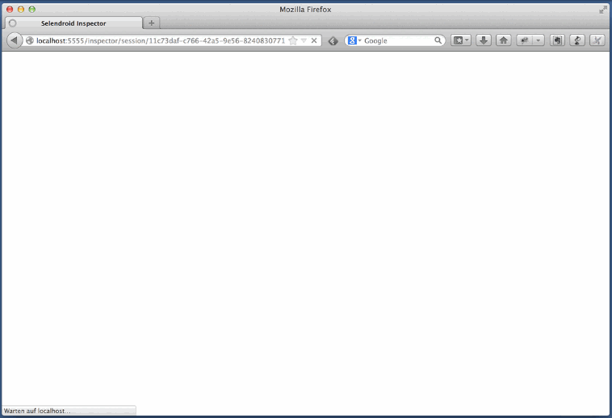
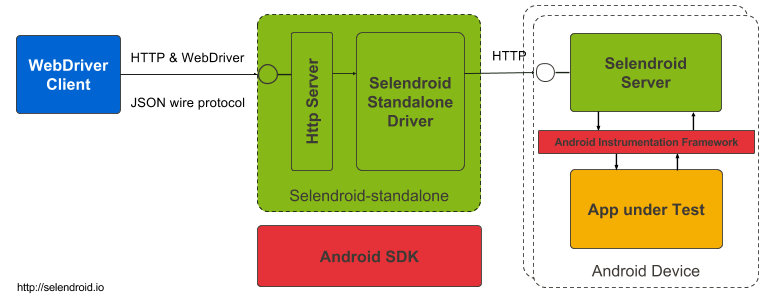

Mobile Test Automation with selendroid
======================================
:author: Dominik Dary and Michael Palotas
:toc:
:icons:
:lang: en
:encoding: UTF-8

This document is an introduction to mobile test automation based on Selendroid.

== Borderless transactions and the impact on test automation

The web has seen a dramatic change over the past few years with mobile becoming a big part of the overall experience.
Test automation is a key enabler for agile software development and subsequently for continuous integration and delivery.
Many software companies are suddenly challenged with having to provide a solid test automation not only for the web but also for mobile with its two flavors mobile web and native apps.

Especially with the onset of mobile commerce and more and more transactions being made on mobile devices, the topic of test automation in the mobile space has gained huge significance.
While in the past customers started and finished a transaction either on the web or on mobile, now there is an increasing trend to "move" between platforms. This means that users may start
a transaction on the web and finish on mobile or vice versa.

This calls for the same robust and scalable test automation approach for mobile as for the web. Ideally the solution for mobile integrates seamlessly with the web solution so that the movement of users between platforms and devices
can easily be recreated as part of an automated test.
Due to the great success and experience with using Selenium for web automation, companies like eBay decided to develop "Selenium for mobile" solutions which namely resulted in the creation of two open source projects: link:http://www.selendroid.io[selendroid] and link:http://ios-driver.github.io/ios-driver[ios-driver].

.The high level requirements that went into the creation of Selendroid and ios-driver were as follows

* reuse of the existing Selenium infrastructure for the web
* implementation of the Selenium protocol (JSON wire protocol)
* the application under test (aut) should not need to be modified
* support for emulators/simulators as well as real devices
* parallel execution of tests in a Selenium Grid
* management of multiple applications, versions, languages
* support for runtime inspection for the app
* hybrid app support
* no jailbreaking of device required

== What is Selenium?
In case you are not familiar with Selenium, here's a very brief introduction to it.
Selenium originally is a tool to automate web browsers. The link:https://code.google.com/p/selenium/wiki/JsonWireProtocol[JSON Wire Protocol] describes user interactions with a browser.
Each browser has a specific driver which is a native implementation for that specific browser. Selenium is a classic client / server architecture.
The client side is decoupled from the driver (server). From a client perspective, the commands to interact with the browser are the same, regardless which browser is used.

.High-level Selenium architecture
image:./images/seleniumClientServer.png[
"My screenshot",width=480,
link="./images/seleniumClientServer.png"]

.Selenium supports the following programming languages (client bindings):

* Java
* C#
* Python
* Ruby
* Perl
* PHP
* JavaScript

=== Selenium Grid

End-To-End tests are very expensive in terms of execution time and computing resources. Besides starting a browser, the whole flow of a user needs to be tested (i.e. sign in, search for something, buy it, pay).
This can take 2-3 minutes - even in an automated fashion. Considering that larger web applications may require hundreds, if not thousands of End-To-End Tests, the execution time of the test suite
can easily reach hours or days - if the tests are executed sequentially. Parallel execution allows to fit more tests into the same timeslot and thereby drastically reducing execution time of the entire test suite.
Selenium Grid allows to run tests in parallel

.Visualization of parallel test execution:

image:./images/grid2.png[width=480,
link="./images/grid2.png"]

.Selenium Grid has two main tasks:
* act as a load balancer for incoming requests from the client(s) and distribute the tests to the registered nodes
* act as a resource manager to match incoming capability requests with the available capabilities in the Grid (a capability could be a platform, version, browser etc.)

.Example architecture for a Selenium Grid:

image:./images/grid.png[
width=480,link="./images/grid.png"]

The nodes (on the right side) send a registration request to the Selenium Grid Hub, telling it their capability. This typically consists of OS, browser, browser version.
The client (left side) sends all tests along with so called Desired Capabilities to the Selenium Grid Hub as a central entry point. The Selenium Grid Hub now tries to match the desired capabilities
to the actually available capabilities. If there is a match, it forwards the test to the node that matches the capabilities. In addition, it has the ability to run tests in parallel by distributing them to all matched nodes.

.What is different about mobile automation?
.While there are of course differences between web and mobile automation, the core job ob a mobile automation tool is the same as for the web:
* find an element (i.e. button)
* interact with the element (i.e. click the button)

Therefore the JSON Wire protocol which was initially created for the web, also applies to the mobile space (except special gestures i.e. swipe).

Now after setting the stage, let's focus on introducing you to Selendroid. The project fulfills the above mentioned requirements and is used in companies like eBay, Salesforce, Salesforce, Saucelabs and Red Hat for their Android automation.

== Selendroid Features
Main features of selendroid are:

* Full compatibility with the link:https://code.google.com/p/selenium/wiki/JsonWireProtocol[JSON Wire Protocol].
* No modification of app under test required in order to automate it
* Testing the mobile web using built in Android driver webview app
* Same concept for automating native or hybrid apps
* UI elements can be found by different locator types
* Gestures are supported: link:http://selendroid.io/gestures.html[Advanced User Interactions API]
* Selendroid can interact with multiple Android devices (emulators or hardware devices) at the same time
* Existing Emulators are started automatically
* Selendroid supports hot plugging of hardware devices
* Full integration as a node into Selenium Grid for link:http://selendroid.io/scale.html[scaling and parallel testing]
* Multiple Android target API support (10 to 19)
* Built in link:http://selendroid.io/inspector.html[Inspector] to simplify test case development.

== In Action

Before selendroid can be used, the system requirements must be met. There is a detailed page with instructions about link:http://selendroid.io/setup.html[how to get started].

In order to keep this example as simple as possible, there is a small demo project in which the link:https://github.com/selendroid/selendroid/tree/master/selendroid-test-app[selendroid-test-app] is used. This is the same app that the project is using to verify that selendroid itself is working fine.

The project link:https://github.com/selendroid/demoproject-selendroid[demoproject-selendroid] is using maven, JUnit and Java to write the tests.

To import selendroid and JUnit the following dependencies declaration is used:

[source,xml]
<dependencies>
	<dependency>
		<groupId>io.selendroid</groupId>
		<version>0.11.0</version>
		<artifactId>selendroid-standalone</artifactId>
	</dependency>
	<dependency>
		<groupId>io.selendroid</groupId>
		<version>0.11.0</version>
		<artifactId>selendroid-client</artifactId>
	</dependency>
	<dependency>
		<groupId>junit</groupId>
		<artifactId>junit</artifactId>
		<version>4.8.2</version>
	</dependency>
</dependencies>

The app under test is located in the folder link:https://github.com/selendroid/demoproject-selendroid/tree/master/src/main/resources[src/main/resources/].

=== Starting selendroid-standalone

Before the client driver can be instantiated the selendroid-standalone component must be started. 

This can be done via a shell by running the following command: 

[source,shell]
	java -jar selendroid-standalone-0.11.0-with-dependencies.jar -app selendroid-test-app-0.11.0.apk

Another option is to start the selendroid-standalone component directly from the test code:

[source,java] 
	SelendroidConfiguration config = new SelendroidConfiguration();
	config.addSupportedApp("src/main/resources/selendroid-test-app-0.11.0.apk");
	selendroidServer = new SelendroidLauncher(config);
	selendroidServer.launchSelendroid();

You can check that the application(s) and the devices are recognized by opening a browser and navigating to: link:http://localhost:4444/wd/hub/status.

You should see a result similar to this:
[source,javascript]
	{
	  status: 0,
	  value: {
	  "os": {
	    "name": "Android"
	    },
	  "build": {
	    "browserName": "selendroid",
	    "version": "0.11.0"
	  },
	  "supportedApps": [{
	    "appId": "io.selendroid.testapp:0.11.0",
	    "mainActivity": "io.selendroid.testapp.HomeScreenActivity",
	    "basePackage": "io.selendroid.testapp"
	  }],
	  "supportedDevices": [{
	    "screenSize": "320x480",
	    "targetPlatform": "ANDROID17",
	    "emulator": true,
	    "avdName": "latest"
	  }]
	}

=== The first Test

Tests are written using the Selenium 2 client API. For Java we provide selendroid-client libraries that are used in the following example:

[source,java]
	SelendroidCapabilities capa = new SelendroidCapabilities("io.selendroid.testapp:0.11.0");
	SelendroidDriver selendroidDriver = new SelendroidDriver(capa);
	WebElement inputField = selendroidDriver.findElement(By.id("my_text_field"));
	Assert.assertEquals("true", inputField.getAttribute("enabled"));
	inputField.sendKeys("Selendroid");
	Assert.assertEquals("Selendroid", inputField.getText());
	selendroidDriver.quit();

In order to create a new test session in the desired capabilities, the id of the app under test must be provided in the format: io.selendroid.testapp:0.11.0. Based on that information a matching Android device will be identified, otherwise the test session will throw an error and not start. 

After the found device has been initialized, a customized selendroid-server will be created and automatically installed on the device. The app under test will also be installed and the selendroid-server on the device will then be automatically started.

After the test session has been successfully initialized, the test commands such as 'find an element' and 'element interactions' are routed to this device. If the test session has ended, the emulator will stop automatically.

=== Switching Context

As described above, selendroid can automate native and hybrid apps and the mobile web.
When a selendroid test session is started, by default the native mode is activated. 

Available contexts can be retrieved via:

[source,java]
selendroidDriver.getContextHandles();

When a webview is available, above method will return a "WEBVIEW" context handle.

[source,java]
String contextHandleName="WEBVIEW";
selendroidDriver.context(contextHandleName);

When a context switch is done, all WebDriver commands are redirected to the corresponding context. 

=== Interacting with Elements

Before interacting with elements first the elements need to be found. Multiple Element locator strategies are supported, for details please have a look at selendroid's documentation.

This is the list of supported element interactions:

* Get Text
* Click
* Send Keys
* Get Attribute of Element
* Clear
* Submit
* Is Selected
* Is Displayed
* Is Enabled
* Get Size
* Get Location

The biggest advantage of using selendroid is the smooth switch between native and web contexts. 

=== Selenium Grid Support

Selendroid can be integrated into the selenium grid as a normal node. There are multiple steps required which are in detail described in the link:http://selendroid.io/scale.html[documentation]

== Selendroid Inspector

Selendroid comes with a useful little tool called Selendroid Inspector. It’s a little web app which is embedded inside your selendroid test server. Its purpose is to let you inspect the current state of your app’s UI.

The main features are:

* View hierarchy
* View UI element properties
* UI screenshot with view locator
* Record the click actions
* Display the source html of a web view
* XPath helper

.Selendroid's Inspector

== Selendroid's Architecture

Selendroid is based on the Android instrumentation framework, and therefore only testing one app is supported. Selendroid contains four major components:

*    Selendroid-Client - the java client library (based on the selenium java client).
*    Selendroid-Server - that is running beside your app on the Android device.
*    AndroidDriver-App - a built in Android driver webview app to test the mobile web.
*    Selendroid-Standalone - manages different Android devices by installing the selendroid-server and the app under test.

Below you can see an overview about the architecture:

.Selendroid's Architecture

=== Selendroid-Standalone

This components acts as a proxy between the selendroid-client and the selendroid-server and starts e.g. an Android emulator, creates for the app under test a customized selendroid-server and installs everything on the device. After the session is initialized on the device, subsequent requests are directly forwarded to the server on the device and the response routed back to the client.

=== Selendroid-Server

This server component runs on the device and is implementing the JSON Wire protocol for Android native and hybrid contexts. The base framework to interact with the app under test is the link:http://developer.android.com/tools/testing/testing_android.html[Android Instrumentation framework].

Internally the web view related driver class is SelendroidWebDriver and native class is SelendroidNativeDriver. SelendroidWebDriver is using Automation Atoms of the selenium project to interact with the elements in the web view. 

== State of the project

Selendroid open source project is in active development and got already multiple contributions from link:https://github.com/selendroid/selendroid/blob/master/AUTHORS[different conttributors] and companies like eBay, salesforce, Red Hat and Facebook.

== Authors

=== Biography Dominik Dary
While working as Staff Software Engineer in Test at ebay international, link:https://github.com/DominikDary/[Dominik Dary] created link:http://selendroid.io[selendroid]. Currently he is working as Technical Lead Quality in one of Adobe's cloud platforms. He   continues to contribute and lead the project selendroid during his spare time. Dominik is a recognized expert in test engineering and test automation and has spoken at many conferences around the world.

=== Biography Michael Palotas
In addition to his role as Head of Productivity & Test Engineering at eBay International, Michael Palotas is founder of Gridfusion Software Solutions, a consultancy that focuses on test automation with open source toolsets and agile testing practices. Michael was a key driver behind the creation of Selenium Grid and more recently the creation of Selendroid and ios-driver. After working in various lead roles in software development and test for Ericsson, Nortel Networks and Intel in North America and Europe, Michael joined eBay in 2004 and founded Gridfusion in 2011. Michael is a recognized expert in test engineering and test automation and has spoken at many conferences and events around the world.
